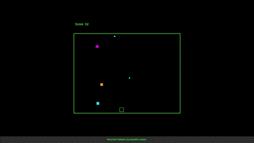

# Pew Pew Cubed

Enter a retro-cyberpunk world where you, a fearless neon-outlined cube, must blast your way through a relentless barrage of falling blocks. Shoot, dodge, and... well, that's pretty much it! Simple.

## 🎮 Game Overview

In *Pew Pew Cubed*, you're a neon green cube with one mission: to shoot stuff. Blocks fall from above, and it’s your job to blast them into oblivion before they reach the bottom. For every block you hit, you score a point. Miss? No worries – they just vanish! This game is all about relaxing, zoning out, and enjoying a little cube-blasting action.

## 📜 How to Play

1. **Move Left & Right** – Use the **Arrow Keys** or your **mouse** to glide effortlessly across the bottom of the screen.
2. **Fire Bullets** – Press **Space** or simply **click within the game area** to shoot.
3. **Pause/Resume** – Press **ESC** or **P** to pause/unpause the game.

## 🔥 Features

- **Endless Falling Blocks**: Blocks fall continuously. Hit them or let them fall – either way, they won’t stop coming.
- **Score Counter**: Track your hits. There's no real end or high score; just see how far you can go!
- **Comedic Futility**: It's just you, your cube, and infinite blocks. Who knew existential dread could be this fun?

## 🔧 Development Setup

This is an HTML/JavaScript project with no dependencies. Just use your browser, edit to your heart’s content, and refresh to test!

---
